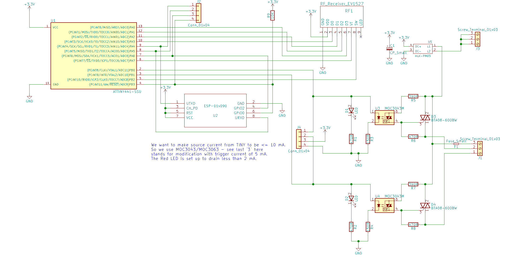

# ESP8266 Dual RF switch

## Schematics

## Layout

## Firmware

There are two microcontrollers to run this switch
* **ESP-01** - use Tasmota firmware fork: https://github.com/foxel/Sonoff-Tasmota/tree/foxel_dual_rf
* **ATTINY441** - firmware is in `attiny-firmware` folder. This requires ATTinyCore to build: https://github.com/SpenceKonde/ATTinyCore
