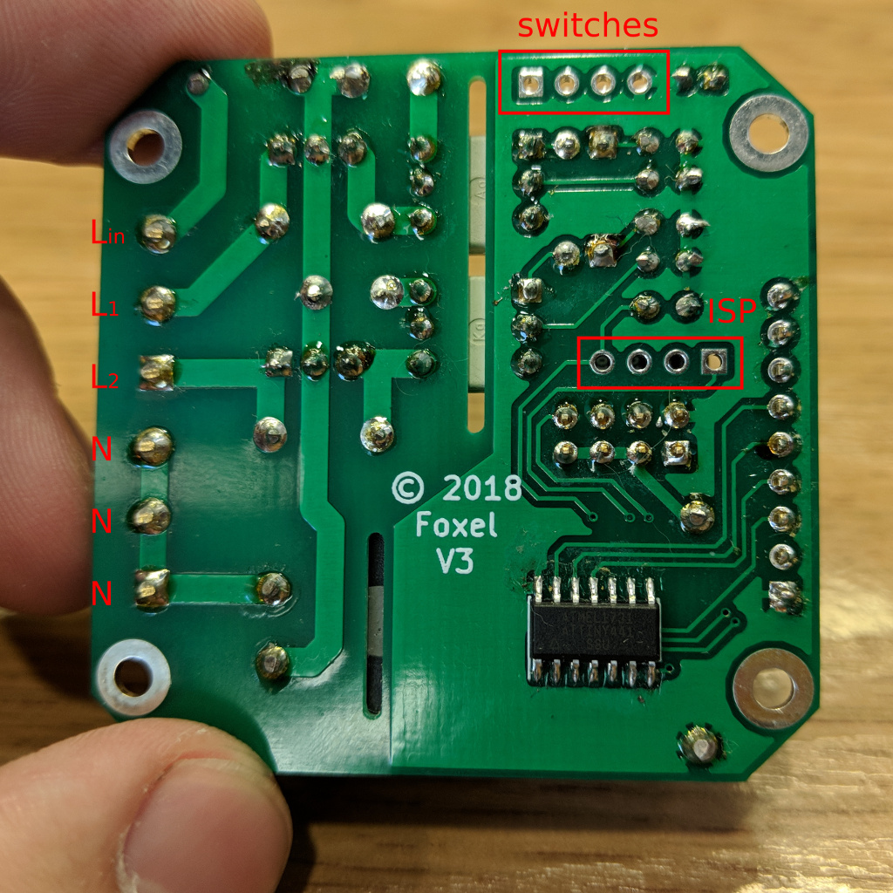

# LightFox Dual - ESP8266 Dual RF switch for lights

## Connecting the board

The board has following connectors:
* mains connector with sqrew terminals (`Lin`, `L1`, `L2`, `N`). Mains supply should be connected to `Lin` and one of `N` terminals. The loads are connected to `L1`/`L2` and one of `N` terminals.
* ISP connector for ATTiny flashing. Pins are (from left to right): `RST`, `MOSI`, `MISO`, `SCL`)
* switches output connector for debug, etc. These are connected to ATTiny outputs controlling triacs. Pins are (from left to right): `L1`, `L2`, `3V3`, `GND`.

## Schematics

## Layout

## Firmware

There are two microcontrollers to run this switch
* **ESP-01** - use Tasmota firmware fork: https://github.com/foxel/Sonoff-Tasmota/tree/foxel_dual_rf
* **ATTINY441** - firmware is in `attiny-firmware` folder. This requires [ATTinyCore](https://github.com/SpenceKonde/ATTinyCore) to build

To flash ESP module connect it to PC any available way (e.g. USB-Serail adapter + breadboard) and follow Tasmota flashing instructions.

To flash ATTINY:
* remove ESP-01 module from the header
* connect ISP programmer (i.e. Arduino flashed with ArduinoISP) to ISP port
* use Arduino to flash MC: board is ATTiny441 (installed from [ATTinyCore](https://github.com/SpenceKonde/ATTinyCore))

## BOM

Item | Qty | Reference(s) | Link
-----|-----|--------------|------
100uF, 5v | 1 | C1 | 
3mm red LED | 2 | D1, D2 | 
BTA08-600BW | 2 | D3, D4 | 
1A fuse | 1 | F1 | 
Screw Terminal 01x03 | 2 | J1, J3 | 
4pin header | 2 | J2, J4 | 
470R, 0.125W | 2 | R1, R2 | 
150R, 0.125W | 2 | R3, R4 | 
390R, 0.5W | 2 | R5, R7 | 
470R, 0.5W | 2 | R6, R8 | 
10K, 0.125W | 1 | R9 | 
Itead.cc RF receiver | 1 | RF1 | https://www.itead.cc/rf-receiver-module-433mhz.html
ATTINY441-SSU | 1 | U1 | 
ESP-01S | 1 | U2 | 
MOC3043M/MOC3063M | 2 | U3, U4 | 
HLK-PM03 | 1 | U5 | 

